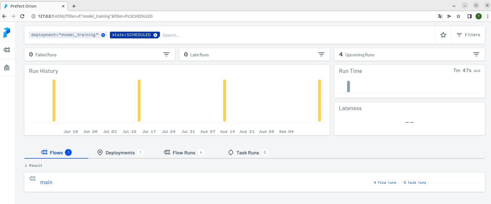
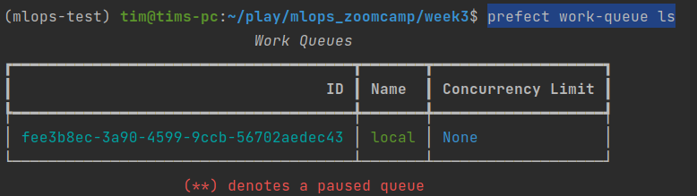

Q1. train_model

Q2. The MSE of validation is: 11.637

Q3. 13,000 bytes

Q4. 0 9 15 * *

- prefect storage create
- prefect deployment create homework.py
- 
Q5. I see four 4 scheduled runs

Q6. prefect work-queue ls

- prefect work-queue preview --hours 500 fee3b8ec-3a90-4599-9ccb-56702aedec43